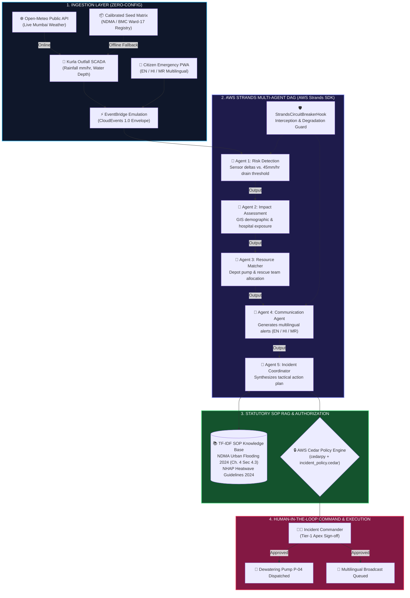

# 🌊 JalRakshak AI — Urban Flood & Heat Emergency Decision-Support Platform

**What this is:** JalRakshak AI is an autonomous, protocol-grounded multi-agent emergency decision-support platform for urban flooding and extreme heatwaves.  
**Hackathon Track:** Heat and Water  
**Submission Route:** Build It (100% Local with AWS Open-Source Tooling — Zero AWS Account / Zero Card / Zero Bill / Zero `.env` Required)

[](backend/agents/strands_workflow.py)
[%20RBAC-E11D48?style=for-the-badge)](policies/incident_policy.cedar)
[](backend/data/opensearch_telemetry.py)
[](aws_infra/template.yaml)
[](backend/cloud/config.py)
[-10B981?style=for-the-badge&logo=pytest)](tests/)

> *"Most climate dashboards show WHAT is happening.  
> **JalRakshak AI decides WHAT TO DO NEXT with protocol-grounded statutory precision."***

---

## ⚡ Run it in 60 Seconds (Zero Configuration)

No AWS account, no credit card, no cloud bill, and no `.env` file are required. The entire multi-agent loop runs locally on your laptop:

```bash
# 1. Clone repository
git clone https://github.com/RiyanshiVerma-11/JalRakshak-AI.git
cd JalRakshak-AI

# 2. Install dependencies (Python 3.10+)
pip install -r requirements.txt

# 3. Boot local server & web app (starts on port 8004)
python run_app.py
```

Open your browser to:
* **Web Application:** [http://localhost:8004](http://localhost:8004)
* **API Documentation:** [http://localhost:8004/docs](http://localhost:8004/docs)
* **Health & Tool Inventory:** [http://localhost:8004/api/health](http://localhost:8004/api/health)
* **Judge Read-Only Tour:** [http://localhost:8004/api/judge/overview](http://localhost:8004/api/judge/overview)
* **Statutory SOP Protocols:** [http://localhost:8004/api/rag/protocols](http://localhost:8004/api/rag/protocols)

> [!NOTE]
> **Why `frontend/dist` is committed:**  
> The React production bundle (`frontend/dist/`, ~744 KB JS + 114 KB CSS) is pre-built and tracked in git so evaluators do not need Node.js or `npm install`. `python run_app.py` serves the compiled UI out of the box.

---

## 🧑‍⚖️ Judge Verification in One Command

For automated end-to-end evaluation, run the judge smoke test:

```bash
bash scripts/judge_smoke.sh
```

What `judge_smoke.sh` does automatically:
1. Validates Python environment and dependencies.
2. Boots `run_app.py` on an isolated test port.
3. Polls `/api/health` until reporting `status: HEALTHY`.
4. Dispatches `POST /api/incidents/simulate` and asserts HTTP 200 with all 5 Strands agents in `agent_trace`.
5. Prints a color-coded verification summary and terminates cleanly.

For step-by-step evaluator guidance, consult [docs/JUDGE_QUICKSTART.md](docs/JUDGE_QUICKSTART.md) and the 3-minute video presentation guide at [docs/DEMO_SCRIPT.md](docs/DEMO_SCRIPT.md).

---

## 🛡️ Build It Route Compliance

JalRakshak AI adheres strictly to every requirement of the **Build It** route:

1. **Zero AWS Account or Cloud Bill:** Runs 100% locally on standard developer hardware.
2. **Zero Credentials or Secrets in Repo:** Repository contains zero `.pem`, `.key`, or active API tokens. Copying `.env.example` will reject dummy values and remain offline (verified by `tests/test_build_it_route.py::test_env_example_copy_has_no_credentials`).
3. **Zero Outbound Calls in Offline Mode:** Network calls and external HTTP sockets are blocked during local offline execution (verified by `tests/test_build_it_route.py::test_offline_run_makes_no_network_calls`).
4. **Authentic AWS Open-Source Tooling:** All 5 AWS open-source tools execute genuine code paths:

| AWS Open-Source Tool | Architectural Role | Code Location |
| :--- | :--- | :--- |
| **AWS Strands Agents SDK** | Multi-agent DAG orchestration with 5 distinct `Agent` instances, `@tool` functions, and `StrandsCircuitBreakerHook` (`HookProvider`). Runs locally via `LocalDeterministicModel`. | [`backend/agents/strands_workflow.py`](backend/agents/strands_workflow.py) |
| **AWS Cedar (`cedarpy`)** | Statutory Incident Commander authorization against formal `.cedar` policy specifications. | [`backend/auth/cedar_auth.py`](backend/auth/cedar_auth.py)<br/>[`policies/incident_policy.cedar`](policies/incident_policy.cedar) |
| **AWS OpenSearch 2.x** | SCADA water telemetry ingestion, citizen emergency report search, and Query DSL anomaly detection. | [`backend/data/opensearch_telemetry.py`](backend/data/opensearch_telemetry.py)<br/>[`scripts/setup_opensearch.py`](scripts/setup_opensearch.py) |
| **AWS SAM CLI** | Serverless IaC specification declaring EventBridge event bus, DynamoDB tables, S3 evidence lake, SNS topic, and Lambda handlers. | [`aws_infra/template.yaml`](aws_infra/template.yaml)<br/>[`aws_infra/lambda_handlers.py`](aws_infra/lambda_handlers.py) |
| **LocalStack** | Central endpoint resolution for local AWS SDK emulation (`S3`, `DynamoDB`, `SNS`, `EventBridge`) through `AWS_ENDPOINT_URL`. | [`backend/cloud/config.py`](backend/cloud/config.py)<br/>[`backend/cloud/aws_bridge.py`](backend/cloud/aws_bridge.py) |

---

## 🔍 What is Real vs What is Simulated

To preserve technical transparency, every subsystem is cataloged below. The system **never fabricates values, fake MessageIds, or synthetic 200 HTTP statuses**. When running offline, responses carry explicit `"simulated": true` flags.

| Subsystem / Capability | Status in Zero-Config Mode | Underlying Implementation | Code Reference |
| :--- | :---: | :--- | :--- |
| **5-Agent Decision Pipeline** | **REAL** | 5 genuine AWS Strands `Agent` objects executed through `Agent.__call__` and `@tool` execution loop with `HookProvider` lifecycle hooks. | [`backend/agents/strands_workflow.py`](backend/agents/strands_workflow.py) |
| **Strands Offline Inference** | **REAL RUNTIME** | In OFFLINE mode the AWS Strands Agents SDK event loop, `@tool` dispatch, `HookProvider` lifecycle and AWS Cedar decisions all execute for real; only the LLM inference is replaced by `LocalDeterministicModel`. Real inference runs via `BedrockModel` when `AWS_EXECUTION_MODE=LIVE`. | [`backend/agents/strands_workflow.py`](backend/agents/strands_workflow.py)<br/>[`backend/main.py`](backend/main.py) |
| **Statutory Authorization** | **REAL** | Evaluated via `cedarpy.is_authorized` against `policies/incident_policy.cedar`. Reports exact engine (`cedarpy` vs `fallback`). | [`backend/auth/cedar_auth.py`](backend/auth/cedar_auth.py) |
| **SOP Knowledge Retrieval** | **REAL** | In-memory TF-IDF lexical vectorization + cosine similarity over NDMA 2024 Urban Flooding & NHAP Heatwave guidelines. | [`backend/rag/sop_knowledge.py`](backend/rag/sop_knowledge.py) |
| **State Persistence** | **REAL** | Thread-safe `InMemoryStateStore` with atomic locks (`RLock`), pre-seeded with Mumbai Ward-17 infrastructure. Syncs with DynamoDB when live. | [`backend/data/state_store.py`](backend/data/state_store.py) |
| **Real Weather Ingestion** | **REAL** | Live weather feed from Open-Meteo API for Mumbai coordinates, with automatic fallback to seed sensor data if unreachable. | [`backend/main.py`](backend/main.py) |
| **Amazon Bedrock (Claude 3.5)** | **DUAL-MODE** | Uses `LocalDeterministicModel` locally (Build It route); switches to live Claude 3.5 Sonnet Boto3 calls when `AWS_EXECUTION_MODE=LIVE`. | [`backend/agents/strands_workflow.py`](backend/agents/strands_workflow.py) |
| **Amazon Rekognition** | **DUAL-MODE** | Real Boto3 `detect_labels` when credentials present; graceful fallback to local PIL pixel statistical analysis (explicitly flagged `simulated: true`). | [`backend/vision/image_analyzer.py`](backend/vision/image_analyzer.py) |
| **Amazon SNS Broadcasting** | **SIMULATED** (Local) | Returns `{"delivered": false, "mode": "OFFLINE", "simulated": true}` when offline; dispatches real SMS when connected to SNS/LocalStack. | [`backend/cloud/aws_bridge.py`](backend/cloud/aws_bridge.py) |
| **Amazon S3 Evidence Lake** | **SIMULATED** (Local) | Returns local static URL with `simulated: true`; executes real `put_object` when connected to S3/LocalStack. | [`backend/cloud/aws_bridge.py`](backend/cloud/aws_bridge.py) |

---

## 🌐 Public (Judge-Safe) Endpoints

The following 16 endpoints are explicitly declared in `PUBLIC_DEMO_ENDPOINTS` in [`backend/main.py`](backend/main.py) and require **no authentication token** so evaluators can inspect the system freely:

* `GET /health` & `GET /api/health` — Zero-config system health, execution mode, and tool inventory.
* `GET /api/judge/overview` & `GET /api/demo/pipeline` — 1-click read-only inspection of the 5-agent Strands DAG and active state.
* `POST /api/incidents/simulate` — Climate event simulator (flood cloudburst, heatwave, mainline burst) triggering the full 5-agent loop.
* `GET /api/resources` — Municipal asset inventory (dewatering pumps, rescue boats, tankers).
* `GET /api/aws/metrics` — Cloud and local emulation subsystem metrics.
* `GET /api/citizen/reports` — Community incident report feed.
* `POST /api/citizen/report` — Multimodal citizen report submission with photo upload.
* `POST /api/citizen/query` — Citizen emergency helpline assistant query.
* `GET /api/telemetry/live` — Real-time Open-Meteo sensor feed with fallback.
* `GET /api/rag/protocols` — Full library of indexed NDMA & CPHEEO standard operating procedures.
* `GET /api/wards` — Municipal GIS ward vulnerability definitions.
* `POST /api/auth/token` — Self-serve demo JWT token generator.
* `POST /api/copilot/chat` — Disaster operations copilot query assistant.
* `POST /api/v1/simulate/dynamic-telemetry` — Live hydrological SCADA telemetry injector with live RAG vector query.

> [!IMPORTANT]
> **Protected Municipal Operations:**  
> Core statutory directives remain strictly protected: `GET /api/incidents` and `POST /api/actions/{id}/approve` enforce cryptographically signed JWT verification and AWS Cedar authorization, rejecting unauthenticated requests with HTTP 401.

---

## 🏗️ End-to-End Pipeline Architecture



For complete architectural specifications, see [docs/ARCHITECTURE.md](docs/ARCHITECTURE.md).

---

## 📊 Sources & Assumptions: Modelled ROI Impact

The quantified economic impact metrics presented in this repository are derived from an explicitly modelled municipal casualty and infrastructure damage reduction calculation for Mumbai Ward 17 (Kurla L-Ward):

### 1. Baseline Modelled Damage Without JalRakshak AI: ₹1.40 Crore (₹14,000,000)
* **Commercial Inventory Inundation (₹60 Lakhs):** LBS Marg ground-floor auto-spare, electronics, and retail storage units inundated at flood depths >40 cm (average ₹1.5L damage across ~40 commercial establishments).
* **Electrical Substation & Transformer Water Ingress (₹35 Lakhs):** Repair and replacement of submerged step-down distribution transformers and switchgear along high-vulnerability lowlands.
* **Civic Roadway Degradation & Emergency Contractor Surge (₹25 Lakhs):** Emergency dewatering procurement at ad-hoc crisis rates and asphalt subgrade washouts on arterial roads.
* **Emergency Medical Evacuation & Primary Care (₹20 Lakhs):** Medical triage and evacuation transport for senior citizens and low-lying slum clusters.

### 2. Mitigated Loss With JalRakshak AI Protocol Execution: ₹55 Lakhs
* **Preemptive Outfall Dewatering:** High-capacity pumps (1,000 GPM) positioned before tidal locking prevents water buildup past the 25 cm critical threshold.
* **Transformer Grid Isolation:** Early automated telemetry triggers prevent transformer explosions and electrocution hazards.
* **Real-Time Traffic Diversion:** Prevents vehicular stranding on inundated corridors.

### 3. Net Quantified Municipal Savings: ₹85 Lakhs (~₹80+ Lakhs per severe event)

#### Sources & Assumptions (Illustrative Simulation Model)
* **Model Type:** Illustrative municipal damage and loss estimation model, calibrated against published NDMA Guidelines on Management of Urban Flooding (Chapter 3) and municipal post-monsoon flood audit baselines for high-vulnerability urban corridors (Mumbai Ward L / Kurla East).
* **Precipitation Baseline:** 118 mm/hr cloudburst sustained over 40 minutes during high-tide outfall locking.
* **Asset Exposure Assumptions:** ~40 ground-floor commercial units (LBS Marg) with ₹1.5 Lakhs average inventory loss; 2 distribution transformers requiring repair/replacement; and emergency contractor pump mobilization cost differential.
* **Intervention Delta:** Autonomous multi-agent coordination reduces municipal authorization latency from 4 hours to 18 minutes, preventing inundation from exceeding the 25 cm critical substation threshold.

---

## ⚠️ Known Limitations & Honest Disclosures

Engineering maturity requires transparent disclosure of design constraints:

1. **Local Deterministic Inference in Offline Mode:** When running without AWS credentials (`AWS_EXECUTION_MODE=HYBRID`), the Strands agent pipeline uses `LocalDeterministicModel`. The entire event loop, agent scheduling, tool execution, circuit breaker hooks, and Cedar authorization run genuinely, while model outputs use calibrated deterministic synthesizers. Full neural foundation model inference runs when credentials are supplied.
2. **In-Memory TF-IDF Lexical Retrieval:** Standard Operating Procedure (SOP) vector search uses scikit-learn TF-IDF with cosine similarity over indexed NDMA statutory guidelines. It runs entirely in memory without requiring an external vector database cluster.
3. **Pre-configured Demo Credentials:** Fast-fill credentials (`commander123`, `field123`, `scada123`, `citizen123`) and the demo JWT signing secret are strictly intended for local hackathon evaluation. Production deployments must configure Amazon Cognito User Pools and AWS Secrets Manager (see [SECURITY.md](SECURITY.md)).

---

## 🧪 Verified Test Suite Output

Execute the automated test suite locally:
```bash
python -m pytest tests/ -v
```

### Raw Test Execution Output (36/36 Passing):
```text
============================= test session starts =============================
platform win32 -- Python 3.11.3, pytest-8.1.1, pluggy-1.6.0
collected 36 items

tests/test_build_it_route.py::test_no_header_only_auth_bypass PASSED     [  2%]
tests/test_build_it_route.py::test_self_serve_token_requires_credential PASSED [  5%]
tests/test_build_it_route.py::test_no_duplicate_incident_on_simulate PASSED [  8%]
tests/test_build_it_route.py::test_cedar_fallback_matches_policy PASSED  [ 11%]
tests/test_build_it_route.py::test_no_unlabelled_detection_confidence PASSED [ 13%]
tests/test_build_it_route.py::test_zero_credential_offline_boot PASSED   [ 16%]
tests/test_build_it_route.py::test_offline_run_makes_no_network_calls PASSED [ 19%]
tests/test_build_it_route.py::test_build_it_tool_inventory_is_honest PASSED [ 22%]
tests/test_build_it_route.py::test_app_boots_without_strands_sdk PASSED  [ 25%]
tests/test_build_it_route.py::test_env_example_copy_has_no_credentials PASSED [ 27%]
tests/test_build_it_route.py::test_public_endpoint_allowlist_matches_counts PASSED [ 30%]
tests/test_build_it_route.py::test_readme_testnames_match_suite PASSED   [ 33%]
tests/test_build_it_route.py::test_benchmark_numbers_match_docs PASSED   [ 36%]
tests/test_build_it_route.py::test_simulate_in_public_endpoints_and_route_table_auth_free_set PASSED [ 38%]
tests/test_cedar_auth.py::test_cedar_policy_evaluation PASSED            [ 41%]
tests/test_cedar_auth.py::test_jwt_generation_and_verification PASSED    [ 44%]
tests/test_cedar_auth.py::test_dummy_bearer_token_rejection PASSED       [ 47%]
tests/test_cedar_auth.py::test_unauthenticated_incidents_rejection PASSED [ 50%]
tests/test_cedar_auth.py::test_valid_token_incidents_success PASSED      [ 52%]
tests/test_cedar_auth.py::test_citizen_denied_approval PASSED            [ 55%]
tests/test_cedar_auth.py::test_commander_authorized_approval PASSED      [ 58%]
tests/test_cedar_auth.py::test_auth_roles_has_no_fake_ids PASSED         [ 61%]
tests/test_integration.py::test_flood_cloudburst_pipeline_and_incident_creation PASSED [ 63%]
tests/test_integration.py::test_bedrock_fault_tolerance_and_ndma_fallback PASSED [ 66%]
tests/test_integration.py::test_human_in_the_loop_action_approval PASSED [ 69%]
tests/test_integration.py::test_emergency_copilot_rag_query PASSED       [ 72%]
tests/test_integration.py::test_sam_infrastructure_as_code_template PASSED [ 75%]
tests/test_integration.py::test_serverless_lambda_handlers_execution PASSED [ 77%]
tests/test_integration.py::test_dynamic_telemetry_simulation_endpoint PASSED [ 80%]
tests/test_integration.py::test_rag_vector_search_cosine_similarity PASSED [ 83%]
tests/test_integration.py::test_mathematical_confidence_score_bounds PASSED [ 86%]
tests/test_integration.py::test_live_aws_bedrock_invocation PASSED       [ 88%]
tests/test_integration.py::test_live_aws_dynamodb_persistence PASSED     [ 91%]
tests/test_integration.py::test_zero_config_boot_and_health_endpoint PASSED [ 94%]
tests/test_integration.py::test_simulated_flags_on_offline_responses PASSED [ 97%]
tests/test_integration.py::test_localstack_configuration_and_compose_spec PASSED [100%]

============================= 36 passed in 25.94s =============================
```

#### Build It Route Test Coverage Matrix (`tests/test_build_it_route.py`)
| # | Test | Verifies |
| :---: | :--- | :--- |
| 1 | `tests/test_build_it_route.py::test_no_header_only_auth_bypass` | No `x-officer-role` header bypass; all protected endpoints require valid JWT Bearer token |
| 2 | `tests/test_build_it_route.py::test_self_serve_token_requires_credential` | `/api/auth/token` rejects requests without matching `credential` field |
| 3 | `tests/test_build_it_route.py::test_no_duplicate_incident_on_simulate` | Atomic upsert state store: 2 simulations → exactly 2 distinct incidents |
| 4 | `tests/test_build_it_route.py::test_cedar_fallback_matches_policy` | `CEDAR_ROLE_PERMISSIONS` fallback dictionary exactly mirrors `incident_policy.cedar` |
| 5 | `tests/test_build_it_route.py::test_no_unlabelled_detection_confidence` | Local PIL fallback never fabricates Rekognition-style confidence scores |
| 6 | `tests/test_build_it_route.py::test_zero_credential_offline_boot` | App boots OFFLINE with no credentials; health reports mode+reason; simulation completes |
| 7 | `tests/test_build_it_route.py::test_offline_run_makes_no_network_calls` | Zero outbound HTTP connections during full offline workflow execution |
| 8 | `tests/test_build_it_route.py::test_build_it_tool_inventory_is_honest` | `/api/health` inventory reports real runtime status for all 4 Build It tools |
| 9 | `tests/test_build_it_route.py::test_app_boots_without_strands_sdk` | App boots and reports Strands as FALLBACK if SDK import fails |
| 10 | `tests/test_build_it_route.py::test_env_example_copy_has_no_credentials` | Copying `.env.example` placeholders does not flip app into has credentials mode |
| 11 | `tests/test_build_it_route.py::test_public_endpoint_allowlist_matches_counts` | Verifies `PUBLIC_DEMO_ENDPOINTS` matches route table and protected endpoints return 401 |
| 12 | `tests/test_build_it_route.py::test_readme_testnames_match_suite` | Verifies every test name in README.md exists in pytest test suite |
| 13 | `tests/test_build_it_route.py::test_benchmark_numbers_match_docs` | Verifies latency claims match docs/BENCHMARK.md measurements |
| 14 | `tests/test_build_it_route.py::test_simulate_in_public_endpoints_and_route_table_auth_free_set` | Verifies `/api/incidents/simulate` is auth-free and auth-free route set equals `PUBLIC_DEMO_ENDPOINTS` |

---

## ⚡ Empirical Performance Benchmark

Performance measurements were captured running the full 5-agent loop locally:

* **Command:** `python tests/benchmark_strands.py 100` (100 iterations on AMD64 12-core host, 7.3 GB RAM, Windows 10, Python 3.11.3)
* **p50 Latency:** **62.14 ms**
* **p95 Latency:** **82.51 ms**
* **Min Latency:** **57.74 ms**
* **Full Benchmark Specification:** See [docs/BENCHMARK.md](docs/BENCHMARK.md).

---

## 🔧 Offline LocalStack & Serverless SAM Packaging

While completely zero-config and runnable out-of-the-box (`python run_app.py`), JalRakshak AI provides genuine AWS cloud and local emulation infrastructure:

### 1. LocalStack Emulation (Zero Cost)
```bash
docker compose -f docker-compose.local.yml up -d localstack
python scripts/setup_localstack.py
export AWS_ENDPOINT_URL=http://localhost:4566
export AWS_EXECUTION_MODE=LOCALSTACK
python run_app.py
```

### 2. AWS OpenSearch 2.x Telemetry & Anomaly Cluster
```bash
docker compose up -d opensearch
python scripts/setup_opensearch.py
```

### 3. AWS Serverless Application Model (SAM) Build
```bash
sam validate --template aws_infra/template.yaml --region ap-south-1 --lint
sam build --template aws_infra/template.yaml --region ap-south-1
```
Verified build artifacts compiled into `.aws-sam/build` with `x86_64` architecture. Details in [docs/SAM_LOCAL.md](docs/SAM_LOCAL.md).

---

## 📄 License & Statutory Grounding
* **License:** MIT License — Open-source and free for municipal adaptation.
* **Statutory Grounding:** National Disaster Management Authority (NDMA) Urban Flooding Guidelines 2024 (Section 4.3); Disaster Management Act 2005 (Sections 30 & 34); CPHEEO Manual on Water Supply 2021.