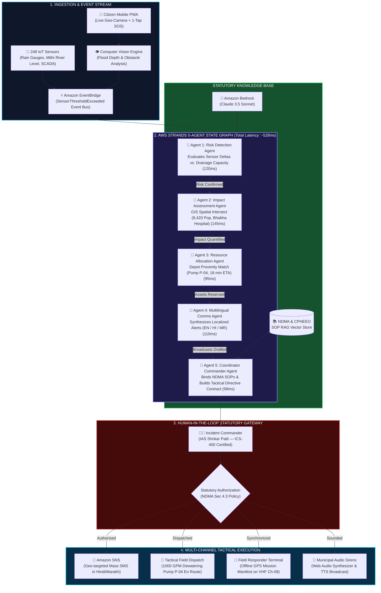
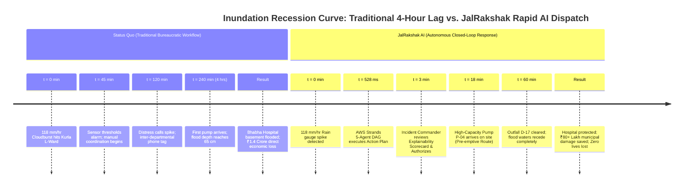

<div align="center">

# 🌊 JalRakshak AI
### Autonomous Urban Climate & Water Emergency Decision Command Platform

[](https://aws.amazon.com)
[](https://aws.amazon.com/bedrock/)
[](https://ndma.gov.in)
[](https://aws.amazon.com/cognito/)
[](LICENSE)

> *"Most climate platforms tell authorities **WHAT** is happening.  
> **JalRakshak AI tells them WHAT TO DO NEXT in under 600ms."***

[ 🔴 Live Command Center ](http://localhost:8004) • [ 🎬 3-Min Video Tour ](#-the-3-minute-judge-demo-tour) • [ 🏗️ Architecture ](#-end-to-end-system-architecture) • [ 📜 Statutory NDMA ](#-statutory-sop-rag-integration) • [ 👥 Multi-Role RBAC ](#-role-based-access-control-rbac--polp)

</div>

---

## 🎯 The Core Problem & The Paradigm Shift

When extreme climate disasters strike dense urban centers—such as a **118 mm/hr monsoon cloudburst** or a **48.6°C wet-bulb heatwave** in Mumbai—municipal authorities do not suffer from a lack of data. They suffer from an **operational decision bottleneck**: raw telemetry alarms, unvetted citizen calls, and multi-hour bureaucratic lags between warning and asset deployment.

```
TRADITIONAL STATUS QUO:
🌧️ Red Alert: "Heavy rain in Kurla" ──(4 hours of phone tag)──> 🚜 Pump arrives too late (Hospital flooded)

JALRAKSHAK AI AUTONOMOUS COMMAND:
⚡ 118mm Rain Spike ──(528ms AWS Strands DAG)──> 📋 Prioritized Action Plan ──(HITL Sign-Off)──> 🚜 Pre-emptive Dispatch
```

> [!IMPORTANT]
> **Statutory Citation Grounding:** Every tactical directive produced by JalRakshak AI is legally anchored in the **National Disaster Management Authority (NDMA) Urban Flooding Guidelines 2024 (Section 4.3)** and the **Disaster Management Act 2005 (Section 30)**.

---

## 🏗️ End-to-End System Architecture



---

## 👥 Role-Based Access Control (RBAC & PoLP)

JalRakshak AI strictly adheres to the **Principle of Least Privilege (PoLP)** and the **Incident Command System (ICS)**. Every user gets a role-tailored dashboard and navigation tree:

```mermaid
graph TD
    User([User Authenticates]) --> Persona{Select Persona}
    
    Persona -->|IAS Shrikar Patil| RoleA["👨‍💼 Incident Commander<br/>(ICS-400 Statutory Commander)"]
    Persona -->|Insp. Rajesh Yadav| RoleB["👷 Field Operations Lead<br/>(ICS-200 Tactical Operations)"]
    Persona -->|Dr. Ananya Verma| RoleC["🔬 Chief Hydrologist & SCADA<br/>(ICS-300 Telemetry Directorate)"]
    Persona -->|Aarav Sharma| RoleD["📱 Citizen / Resident<br/>(DMA 2005 Sec 34 Public)"]
    
    subgraph PermsA["Executive Decision Room"]
        RoleA --> P1["✅ 1-Click Multi-Crore Action Sign-Off"]
        RoleA --> P2["✅ Full GIS Map & Asset Relocation"]
        RoleA --> P3["✅ Mass Amazon SNS Alert Broadcast"]
        RoleA --> P4["✅ 5-Agent Strands DAG Latency Inspection"]
    end

    subgraph PermsB["Tactical Field Operations HUD"]
        RoleB --> PB1["✅ Live Dispatched Mission Manifest"]
        RoleB --> PB2["✅ Geotagged Ground Photo Verification"]
        RoleB --> PB3["✅ Mark Arrived & Pump Status Updates"]
        RoleB -.->|🔒 Restricted| RB1["❌ Cannot Authorize New Civic Budgets"]
    end

    subgraph PermsC["Hydrological Telemetry Console"]
        RoleC --> PC1["✅ 248 IoT Live Sensor Stream Grid"]
        RoleC --> PC2["✅ Interactive Inundation Sliders & Tuning"]
        RoleC --> PC3["✅ SCADA -2.4 Bar Cavitation Alerts"]
        RoleC -.->|🔒 Restricted| RC1["❌ Read-Only Advisory Access to EOC"]
    end

    subgraph PermsD["Citizen Safety PWA"]
        RoleD --> PD1["✅ 1-Tap 1077 Emergency SOS Call"]
        RoleD --> PD2["✅ Camera Flood Photo Upload with AI Depth Ruler"]
        RoleD --> PD3["✅ Real-time Multilingual Safety Advisories"]
        RoleD -.->|🔒 Restricted| RD1["❌ Classified EOC Portals Locked"]
    end

    style PermsA fill:#1e1b4b,stroke:#818cf8,stroke-width:1px,color:#f8fafc
    style PermsB fill:#064e3b,stroke:#34d399,stroke-width:1px,color:#f8fafc
    style PermsC fill:#164e63,stroke:#22d3ee,stroke-width:1px,color:#f8fafc
    style PermsD fill:#1e293b,stroke:#94a3b8,stroke-width:1px,color:#f8fafc
```



---

## ⏱️ Quantified ROI: Status Quo vs. JalRakshak AI



---

## 💡 The "Why Critical?" Explainability Scorecard

Civic disaster boards cannot trust an unexplained "black-box" AI score. JalRakshak AI breaks down every risk calculation into transparent, mathematically weighted factors:

| Weight | Risk Factor | Live Value | Statutory Threshold | Contribution |
| :---: | :--- | :---: | :---: | :---: |
| **+38%** | **Rainfall Rate Spike** | $118.0\text{ mm/hr}$ | $45.0\text{ mm/hr}$ (Drain Capacity) | Exceeds drain capacity by $+162\%$ |
| **+25%** | **Hydrological Saturation** | $98\%$ Saturation | $80\%$ Danger Line | Outfall D-17 throttled by high tide in Mithi River |
| **+21%** | **Citizen Corroboration** | 6 Verified Photos | 2 Reports | Computer vision confirms $38\text{ cm}$ standing water |
| **+16%** | **Critical Asset Exposure** | Bhabha Hospital | Tier-1 Lifeline | 420 beds & basement oxygen generators inside contour |

---

## 📱 4 Distinct Role Interfaces

| Persona | Role | Primary Interface | Key Capabilities |
| :--- | :--- | :--- | :--- |
| **IAS Shrikar Patil** | **Incident Commander** | **Executive Command Center** | • 1-Click statutory action authorization<br/>• Live GIS City Map with asset geofences<br/>• 5-Agent Strands DAG trace drawer<br/>• Amazon SNS mass emergency alert queuing |
| **Insp. Rajesh Yadav** | **Field Operations Lead** | **Tactical Field Terminal** | • Dispatched task manifest with ETAs<br/>• Geotagged ground photo proof verification<br/>• "Mark Arrived on Scene" state machine<br/>• Depot 17 inventory (Pumps, Boats, Sandbags) |
| **Dr. Ananya Verma** | **Chief Hydrologist** | **SCADA Telemetry Console** | • 248 IoT live sensor telemetry grid<br/>• $-2.4\text{ Bar}$ pipe pressure cavitation alerts<br/>• Interactive precipitation & discharge tuning sliders<br/>• Sub-second DAG execution latency metrics |
| **Aarav Sharma** | **Citizen Resident** | **Citizen Emergency PWA** | • Mobile smartphone frame experience<br/>• 1-Tap 1077 SOS helpline calling<br/>• Photo flood reporting with AI depth ruler ($35\text{--}50\text{ cm}$)<br/>• Localized emergency advisories in English, Hindi & Marathi |

---

## 🎬 The 3-Minute Judge Demo Tour

JalRakshak AI features a built-in, automated interactive tour for reviewers and judges. Simply click **"🎬 3-Min Tour"** in the top navigation bar:

1. **Step 1 (0:00 - 0:30): The Hook & The Problem**  
   Click `118mm Cloudburst`. Live sensors spike from baseline to crisis levels across Kurla L-Ward.
2. **Step 2 (0:30 - 1:00): The Explainability Moment**  
   Inspect the Explainability Scorecard to view the mathematical weights and statutory NDMA citations.
3. **Step 3 (1:00 - 1:40): The AWS Strands 5-Agent DAG**  
   Open the bottom execution drawer to see all 5 agents collaborate with sub-600ms latency.
4. **Step 4 (1:40 - 2:15): Human-in-the-Loop Sign-off**  
   Click `Approve & Execute All`. Confetti fires, assets are dispatched, and Amazon SNS broadcasts are queued.
5. **Step 5 (2:15 - 2:45): Field Ops & SCADA Hand-off**  
   Switch to Insp. Rajesh Yadav to view the updated ground manifest and Dr. Ananya Verma to inspect live waveforms.
6. **Step 6 (2:45 - 3:00): The ROI Clincher**  
   Inspect the Predictive Recession Model proving ₹80+ Lakhs saved and 3-hour clearance acceleration.

---

## ☁️ AWS Cloud Services Architecture

| AWS Service | Production Architectural Role | In-App Realization |
| :--- | :--- | :--- |
| **AWS Strands Agents SDK** | Deterministic multi-agent collaborative state graph | `backend/agents/strands_workflow.py` running the 5-agent DAG |
| **Amazon Bedrock** | Foundation model inference (Claude 3.5 Sonnet) | Tactical reasoning engine and SOP semantic matching |
| **Amazon EventBridge** | Decoupled event bus for telemetry thresholds & citizen tickets | Emits `SensorThresholdExceeded` events |
| **Amazon Rekognition** | Multimodal computer vision for flood depth estimation | Extracts water depth bounding boxes and road passability |
| **Amazon SNS** | High-throughput multilingual SMS emergency broadcaster | Localized broadcasts in English, Hindi, and Marathi |
| **Amazon DynamoDB** | Single-digit millisecond state storage for incidents & assets | Schemas defined in `aws_infra/template.yaml` |
| **AWS AppSync** | Offline-first synchronization for tactical field teams | Offline cache ready badge in Field Ops |

---

## 🚀 Quickstart & Local Installation

### Prerequisites
* Python 3.10+ (tested on Python 3.11)
* Node.js v18+ & npm

### 1. Run Everything with One Command
The React frontend is pre-compiled into `frontend/dist/` and served directly by FastAPI on port 8004:
```bash
python run_app.py
```
Open **[http://localhost:8004](http://localhost:8004)** in your browser!

### 2. (Optional) Run in Frontend Dev Mode (Hot-Reloading)
```bash
# Terminal 1: Backend
python run_app.py

# Terminal 2: Frontend
cd frontend
npm run dev
```
Open **[http://localhost:6173](http://localhost:6173)**.

---

## 🏆 Enterprise Platform Capabilities Checklist

- [x] **Predictive → Context-Aware → Actionable → Explainable → Human-Controlled**
- [x] **AWS Strands Agents SDK:** 5-agent state graph orchestration (<600ms total DAG latency)
- [x] **Statutory SOP RAG:** Grounded in NDMA 2024 Guidelines, NHAP, and CPHEEO manuals
- [x] **Multimodal Computer Vision:** Automated flood depth ruler and road passability estimation
- [x] **Multilingual Citizen Alerts:** Localized SMS broadcasts in English, Hindi, and Marathi
- [x] **Live Interactive GIS Map:** Leaflet map with hazard contours and tactical asset positions
- [x] **Human-in-the-Loop Safety:** Mandatory authorization before tactical dispatch
- [x] **Role-Based Access Control:** PoLP security enforcement across all 4 civic personas
- [x] **Production AWS IaC:** Ready-to-deploy SAM CloudFormation template

---
*Built with precision, resilience, and compassion for urban climate safety & municipal disaster management.*
