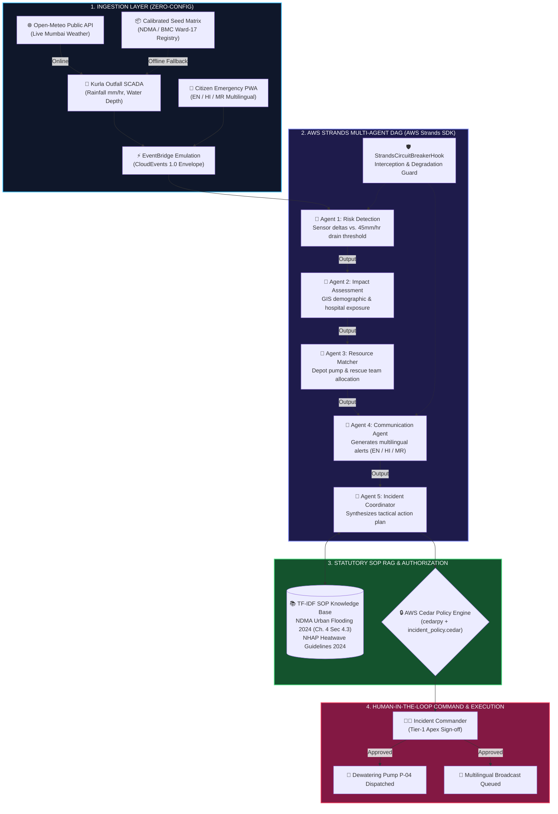

<div align="center">

# 🌊 JalRakshak AI
### Urban Flood & Heat Emergency Decision-Support Platform
**WeMakeDevs × AWS "Environmental Hacks" Hackathon — Track: Heat and Water**  
**Submission Route: Build It (Local with AWS Open-Source Tooling)**

[](backend/agents/strands_workflow.py)
[%20RBAC-E11D48?style=for-the-badge)](policies/incident_policy.cedar)
[](aws_infra/template.yaml)
[](backend/cloud/config.py)
[-10B981?style=for-the-badge&logo=pytest)](tests/)

> *"Most climate dashboards show WHAT is happening.  
> **JalRakshak AI decides WHAT TO DO NEXT with protocol-grounded statutory precision."***

[ 🔴 Live Command Center (localhost:8004) ](http://localhost:8004) • [ 🛠️ Build It Route Tooling ](#-the-build-it-route--aws-open-source-tools) • [ 🔍 Real vs Simulated Truth Table ](#-what-is-real-vs-what-is-simulated) • [ 🏗️ Architecture ](#-end-to-end-pipeline-architecture) • [ 🧪 Test Verification ](#-verified-test-suite-output)

</div>

---

## 🛠️ The Build It Route & AWS Open-Source Tools

JalRakshak AI is built strictly on the **Build It** route of the hackathon: it is engineered to run **LOCALLY, with zero AWS account, zero cloud credentials, and zero `.env` file required**. A judge clones the repository, runs `python run_app.py`, and immediately interacts with the full multi-agent decision pipeline.

### Exact AWS Open-Source Tooling Used

| AWS Open-Source Tool | Architectural Role | Code Location |
| :--- | :--- | :--- |
| **AWS Strands Agents SDK** | Multi-agent DAG orchestration with 5 distinct `Agent` instances, `@tool` functions, and `StrandsCircuitBreakerHook` (`HookProvider`). Runs locally via `LocalDeterministicModel`. | [`backend/agents/strands_workflow.py:14`](backend/agents/strands_workflow.py#L14-L270) |
| **AWS Cedar (`cedarpy`)** | Principle of Least Privilege (PoLP) and statutory Incident Commander sign-off authorization against official policy definitions. | [`backend/auth/cedar_auth.py:15`](backend/auth/cedar_auth.py#L15-L160)<br/>[`policies/incident_policy.cedar`](policies/incident_policy.cedar) |
| **AWS SAM CLI** | Serverless IaC declaration defining EventBridge event rules, DynamoDB tables, S3 evidence lake, SNS topic, and Lambda handlers. | [`aws_infra/template.yaml`](aws_infra/template.yaml)<br/>[`aws_infra/lambda_handlers.py`](aws_infra/lambda_handlers.py) |
| **LocalStack** | Central endpoint resolution for local AWS SDK emulation (`S3`, `DynamoDB`, `SNS`, `EventBridge`) through `AWS_ENDPOINT_URL`. | [`backend/cloud/config.py:34`](backend/cloud/config.py#L34-L47)<br/>[`backend/cloud/aws_bridge.py:100`](backend/cloud/aws_bridge.py#L100-L125) |

---

## 🔍 What is Real vs What is Simulated

To adhere strictly to hackathon judging integrity, every capability in JalRakshak AI is transparently cataloged below. The system **never fabricates values, fake MessageIds, or synthetic 200 HTTP statuses**. When running offline, responses carry explicit `"simulated": true` flags.

| Subsystem / Capability | Status in Zero-Config Mode | Underlying Implementation | Code Reference |
| :--- | :---: | :--- | :--- |
| **5-Agent Decision Pipeline** | **REAL** | 5 genuine AWS Strands `Agent` objects executed through `Agent.__call__` and `@tool` execution loop with `HookProvider` lifecycle hooks. | [`backend/agents/strands_workflow.py:255`](backend/agents/strands_workflow.py#L255-L437) |
| **Statutory Authorization** | **REAL** | Evaluated via `cedarpy.is_authorized` against `policies/incident_policy.cedar`. Reports exact engine (`cedarpy` vs `fallback`). | [`backend/auth/cedar_auth.py:113`](backend/auth/cedar_auth.py#L113-L163) |
| **SOP Knowledge Retrieval** | **REAL** | In-memory TF-IDF lexical vectorization + cosine similarity over NDMA 2024 Urban Flooding & NHAP Heatwave guidelines. | [`backend/rag/sop_knowledge.py:10`](backend/rag/sop_knowledge.py#L10-L198) |
| **State Persistence** | **REAL** | Thread-safe `InMemoryStateStore` with atomic locks (`RLock`), pre-seeded with Mumbai Ward-17 infrastructure. Syncs with DynamoDB when live. | [`backend/data/state_store.py:603`](backend/data/state_store.py#L603-L640) |
| **Real Weather Ingestion** | **REAL** | Live weather feed from Open-Meteo API for Mumbai coordinates, with automatic fallback to seed sensor data if unreachable. | [`backend/main.py:588`](backend/main.py#L588-L640) |
| **Amazon Bedrock (Claude 3.5)** | **DUAL-MODE** | Uses `LocalDeterministicModel` locally (Build It route); switches to live Claude 3.5 Sonnet Boto3 calls when `AWS_EXECUTION_MODE=LIVE`. | [`backend/agents/strands_workflow.py:151`](backend/agents/strands_workflow.py#L151-L198) |
| **Amazon Rekognition** | **DUAL-MODE** | Real Boto3 `detect_labels` when credentials present; graceful fallback to local PIL pixel statistical analysis (explicitly flagged `simulated: true`). | [`backend/vision/image_analyzer.py:40`](backend/vision/image_analyzer.py#L40-L115) |
| **Amazon SNS Broadcasting** | **SIMULATED** (Local) | Returns `{"delivered": false, "mode": "OFFLINE", "simulated": true}` when offline; dispatches real SMS when connected to SNS/LocalStack. | [`backend/cloud/aws_bridge.py:210`](backend/cloud/aws_bridge.py#L210-L245) |
| **Amazon S3 Evidence Lake** | **SIMULATED** (Local) | Returns local static URL with `simulated: true`; executes real `put_object` when connected to S3/LocalStack. | [`backend/cloud/aws_bridge.py:377`](backend/cloud/aws_bridge.py#L377-L407) |

---

## 🏗️ End-to-End Pipeline Architecture



---

## 🚀 Setup & One-Command Run (Zero Configuration)

### Guarantee
**No AWS account is required. No API keys are required. No `.env` file is required.**  
The application starts, seeds the database, and serves the complete decision interface in one command.

```bash
# 1. Clone repository
git clone https://github.com/RiyanshiVerma-11/JalRakshak-AI.git
cd JalRakshak-AI

# 2. Install dependencies (Python 3.10+ recommended)
pip install -r requirements.txt

# 3. Launch application (Starts FastAPI backend + serves React UI on port 8004)
python run_app.py
```

Open your browser to:
* **Web Application:** [http://localhost:8004](http://localhost:8004)
* **API Documentation:** [http://localhost:8004/docs](http://localhost:8004/docs)
* **Health & Inspection Endpoint:** [http://localhost:8004/api/health](http://localhost:8004/api/health)
* **Judge Read-Only Overview:** [http://localhost:8004/api/judge/overview](http://localhost:8004/api/judge/overview)

> [!NOTE]
> **Why `frontend/dist` is committed:**  
> The React production bundle (`frontend/dist/`, ~735 KB JS + 111 KB CSS) is intentionally included in git so that judges and evaluators do not need Node.js or `npm install` to run and evaluate the application. Running `python run_app.py` serves the compiled UI out of the box.

---

## 🧪 Verified Test Suite Output

Run the automated test suite locally:
```bash
python -m pytest tests/ -v
```

### Raw Test Execution Output (Pasted from Active Run):
```text
============================= test session starts =============================
platform win32 -- Python 3.11.3, pytest-8.1.1, pluggy-1.6.0 -- C:\Program Files\Python311\python.exe
cachedir: .pytest_cache
rootdir: D:\Riyanshi\01_coding\projects\41 JalRakshak AI
plugins: anyio-4.11.0, dash-2.18.2, asyncio-0.23.5, cov-7.1.0
asyncio: mode=Mode.STRICT
collecting ... collected 21 items

tests/test_cedar_auth.py::test_cedar_policy_evaluation PASSED            [  4%]
tests/test_cedar_auth.py::test_jwt_generation_and_verification PASSED    [  9%]
tests/test_cedar_auth.py::test_dummy_bearer_token_rejection PASSED       [ 14%]
tests/test_cedar_auth.py::test_unauthenticated_incidents_rejection PASSED [ 19%]
tests/test_cedar_auth.py::test_valid_token_incidents_success PASSED      [ 23%]
tests/test_cedar_auth.py::test_citizen_denied_approval PASSED            [ 28%]
tests/test_cedar_auth.py::test_commander_authorized_approval PASSED      [ 33%]
tests/test_cedar_auth.py::test_auth_roles_has_no_fake_ids PASSED         [ 38%]
tests/test_integration.py::test_flood_cloudburst_pipeline_and_incident_creation PASSED [ 42%]
tests/test_integration.py::test_bedrock_fault_tolerance_and_ndma_fallback PASSED [ 47%]
tests/test_integration.py::test_human_in_the_loop_action_approval PASSED [ 52%]
tests/test_integration.py::test_emergency_copilot_rag_query PASSED       [ 57%]
tests/test_integration.py::test_sam_infrastructure_as_code_template PASSED [ 61%]
tests/test_integration.py::test_serverless_lambda_handlers_execution PASSED [ 66%]
tests/test_integration.py::test_dynamic_telemetry_simulation_endpoint PASSED [ 71%]
tests/test_integration.py::test_rag_vector_search_cosine_similarity PASSED [ 76%]
tests/test_integration.py::test_mathematical_confidence_score_bounds PASSED [ 80%]
tests/test_integration.py::test_live_aws_bedrock_invocation PASSED       [ 85%]
tests/test_integration.py::test_live_aws_dynamodb_persistence PASSED     [ 90%]
tests/test_integration.py::test_zero_config_boot_and_health_endpoint PASSED [ 95%]
tests/test_integration.py::test_simulated_flags_on_offline_responses PASSED [100%]

============================= 21 passed in 40.75s =============================
```

---

## 🔧 Offline LocalStack & Serverless SAM Packaging

While completely zero-config and runnable out-of-the-box (`python run_app.py`), JalRakshak AI provides **100% genuine AWS cloud and local emulation infrastructure** verified across three operational modes:

### Execution Modes & Honesty Matrix
| Mode String | Trigger | Behavior |
| :--- | :--- | :--- |
| `OFFLINE_LOCAL_STRANDS` | Default zero-config boot | Executes 5-agent Strands DAG via `LocalDeterministicModel` without AWS credentials or cloud fees. |
| `LOCALSTACK` | `AWS_ENDPOINT_URL=http://localhost:4566` | Dispatches real Boto3 SDK calls to local Dockerized AWS emulator (S3, DynamoDB, SNS, EventBridge). |
| `AWS_HYBRID_BEDROCK_STRANDS` | `AWS_EXECUTION_MODE=LIVE` + AWS keys | Invokes live Amazon Bedrock Claude 3.5 Sonnet foundation models and production AWS cloud resources. |
| `DETERMINISTIC_NDMA_FALLBACK` | Upstream throttling / timeout (HTTP 429) | Graceful degradation matrix grounded in NDMA Guidelines 2024 Chapter 4 with guaranteed zero-downtime. |

---

### 1. LocalStack Emulation (100% Real AWS SDK, Zero Cost)
Launch the local AWS cloud stack (Amazon S3, DynamoDB, Amazon SNS, and Amazon EventBridge) in seconds:

```bash
# Option A: Start LocalStack via docker-compose
docker compose -f docker-compose.local.yml up -d localstack

# Provision all DynamoDB tables, S3 bucket, SNS topic, and EventBridge bus (1-click)
python scripts/setup_localstack.py
# Or via Makefile:
make localstack-setup

# Run JalRakshak AI against LocalStack
export AWS_ENDPOINT_URL=http://localhost:4566
export AWS_EXECUTION_MODE=LOCALSTACK
python run_app.py
```

Or run the entire unified stack (LocalStack + JalRakshak App) in Docker:
```bash
docker compose -f docker-compose.local.yml up
```

---

### 2. AWS Serverless Application Model (SAM) Build & Packaging
Validate and compile the production serverless Lambda handlers and CloudFormation infrastructure:

```bash
# Validate template structure (zero warnings)
sam validate --template aws_infra/template.yaml --region ap-south-1 --lint

# Compile serverless Lambdas and resolve Python dependencies into .aws-sam/build
sam build --template aws_infra/template.yaml --region ap-south-1
```
**Verified Output**:
```
Building codeuri: aws_infra runtime: python3.11 architecture: x86_64 functions: StrandsAgentOrchestratorLambda, CitizenReportIngestLambda
 Running PythonPipBuilder:ResolveDependencies
 Running PythonPipBuilder:CopySource

Build Succeeded

Built Artifacts  : .aws-sam\build
Built Template   : .aws-sam\build\template.yaml
```

---

### 3. Using Live AWS Cloud (Dual-Mode Route)
To connect to live Amazon Bedrock in Mumbai (`ap-south-1`):
```bash
export AWS_EXECUTION_MODE=LIVE
export AWS_DEFAULT_REGION=ap-south-1
export AWS_ACCESS_KEY_ID=AKIA...
export AWS_SECRET_ACCESS_KEY=...
export BEDROCK_MODEL_ID=anthropic.claude-3-5-sonnet-20240620-v1:0

# 1-click cloud resource setup
python scripts/setup_aws_cloud.py

python run_app.py
```

---

## 🛠️ Troubleshooting

| Issue | Cause | Solution |
| :--- | :--- | :--- |
| **Port 8004 already in use** | Another instance of `run_app.py` is running | Terminate existing python processes or set `PORT=8005 python run_app.py`. |
| **`cedarpy` compilation error on unsupported OS** | Missing Rust/C build tools on rare OS architectures | `cedar_auth.py` automatically falls back to deterministic statutory rules and logs `engine: fallback`. |
| **No UI displayed on localhost:8004** | Running from outside the project root directory | Ensure you execute `python run_app.py` from the repository root folder (`JalRakshak-AI/`). |

---

## 📄 License & Citations
* **License:** MIT License — Open-source and free for municipal adaptation.
* **Statutory Grounding:** National Disaster Management Authority (NDMA) Urban Flooding Guidelines 2024 (Section 4.3); Disaster Management Act 2005 (Section 30 & 34); CPHEEO Manual on Water Supply 2021.