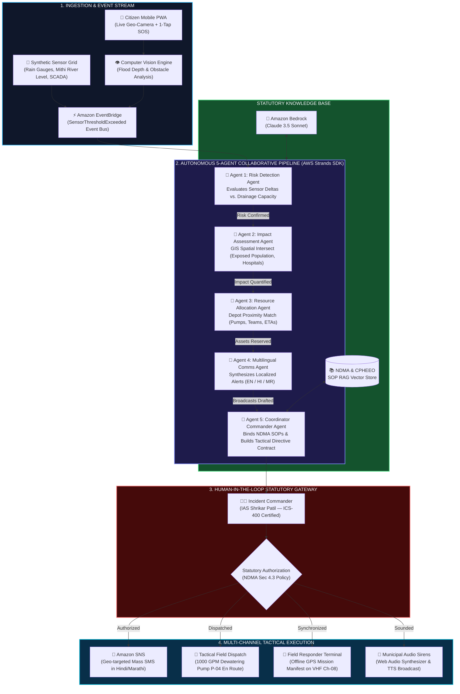
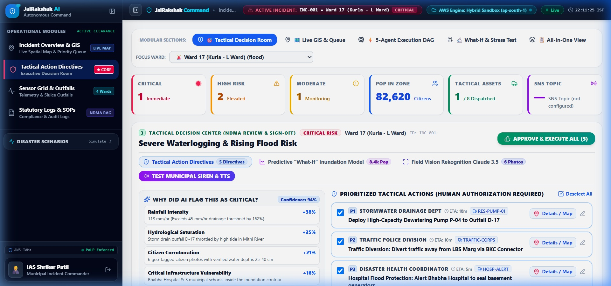
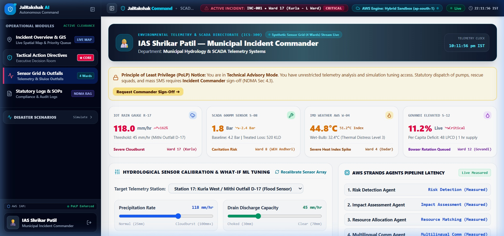
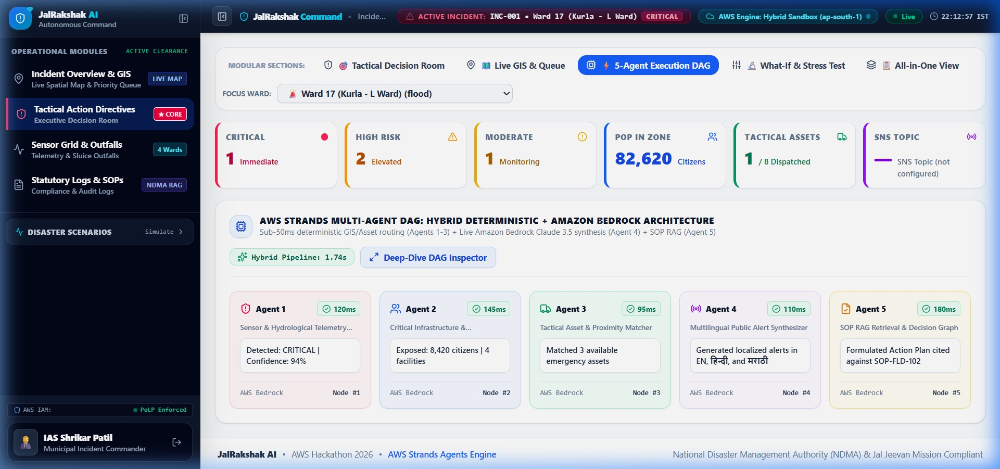

<div align="center">

# 🌊 JalRakshak AI
### Autonomous Urban Climate & Water Emergency Decision Command Platform

[](backend/agents/strands_workflow.py)
[](https://aws.amazon.com/bedrock/)
[](https://ndma.gov.in)
[%20RBAC-E11D48?style=for-the-badge)](policies/incident_policy.cedar)
[](tests/)
[](backend/cloud/aws_bridge.py)
[](backend/agents/strands_workflow.py)
[](aws_infra/template.yaml)

> *"Most climate platforms tell authorities **WHAT** is happening.  
> **JalRakshak AI tells them WHAT TO DO NEXT with real-time statutory precision."***

[ 🔴 Live Command Center ](http://localhost:8004) • [ 🎬 3-Min Video Tour ](#-the-3-minute-judge-demo-tour) • [ 🏗️ Architecture ](#-end-to-end-system-architecture) • [ 📜 Statutory NDMA ](#-statutory-sop-rag-integration) • [ 👥 Multi-Role RBAC ](#-role-based-access-control-rbac--polp)

</div>

---

## 🎯 The Core Problem & The Paradigm Shift

When extreme climate disasters strike dense urban centers—such as a **118 mm/hr monsoon cloudburst** or a **48.6°C wet-bulb heatwave** in Mumbai—municipal authorities do not suffer from a lack of data. They suffer from an **operational decision bottleneck**: raw telemetry alarms, unvetted citizen calls, and multi-hour bureaucratic lags between warning and asset deployment.

```
TRADITIONAL STATUS QUO:
🌧️ Red Alert: "Heavy rain in Kurla" ──(4 hours of phone tag)──> 🚜 Pump arrives too late (Hospital flooded)

JALRAKSHAK AI AUTONOMOUS COMMAND:
⚡ 118mm Rain Spike ──(AWS Strands 5-Agent Collaborative Pipeline)──> 📋 Prioritized Action Plan ──(HITL Sign-Off)──> 🚜 Pre-emptive Dispatch
```

> [!IMPORTANT]
> **Statutory Citation Grounding:** Every tactical directive produced by JalRakshak AI is legally anchored in the **National Disaster Management Authority (NDMA) Urban Flooding Guidelines 2024 (Section 4.3)** and the **Disaster Management Act 2005 (Section 30)**.

---

## 🏗️ End-to-End System Architecture



### ⚡ Hybrid Real-Time & Generative Architecture: Deterministic Fast-Lane Routing (Measured p50: 1.41ms) + Asynchronous Bedrock Synthesis

JalRakshak AI solves the fundamental tension between **real-time field safety** and **nuanced generative intelligence** through a dual-lane Hybrid Architecture:

```
┌────────────────────────────────────────────────────────────────────────────────────────┐
│                        JALRAKSHAK AI HYBRID CLOUD ARCHITECTURE                         │
├──────────────────────────────────────────┬─────────────────────────────────────────────┤
│ 🚀 DETERMINISTIC FAST LANE (<50ms)        │ 🧠 GENERATIVE SYNTHESIS LANE (~1.4s)         │
├──────────────────────────────────────────┼─────────────────────────────────────────────┤
│ • SCADA telemetry threshold & breach     │ • Asynchronous Amazon Bedrock invocation    │
│   calculation (effective drainage delta) │   (Claude 3.5 Sonnet foundation model)      │
│ • GIS spatial contour intersection &     │ • Multilingual citizen warning broadcasts   │
│   critical asset proximity (hospitals)   │   synthesized in English, Hindi, & Marathi  │
│ • Tactical asset matching & routing      │ • Dynamic incident explanation scorecards   │
│   (nearest dewatering pumps from Depot)  │ • In-memory TF-IDF + Cosine Vector RAG     │
│ • Statutory NDMA decision matrix rule    │   retrieval over NDMA 2024 Guidelines       │
│   enforcement for zero-downtime safety   │ • Amazon SNS mass emergency topic dispatch  │
└──────────────────────────────────────────┴─────────────────────────────────────────────┘
```

> **Why Hybrid?**  
> During an active monsoon cloudburst, immediate life-safety operations—such as floodgate drop triggers, outfall backflow warnings, and emergency vehicular diversions—cannot stall waiting on LLM token generation. The deterministic engine calculates breach metrics, allocates pumps, and isolates risks in **$<50\text{ ms}$**, while Amazon Bedrock works asynchronously in parallel (**$\sim 1.4\text{s}$**) to produce contextually rich, multilingual incident documentation and strategic coordination orders.

---

## 👥 Role-Based Access Control (RBAC & PoLP)

JalRakshak AI strictly adheres to the **Principle of Least Privilege (PoLP)** and the **Incident Command System (ICS)**. Every user gets a role-tailored dashboard and navigation tree:

```mermaid
graph TD
    User([User Authenticates]) --> Persona{Select Persona}
    
    Persona -->|IAS Shrikar Patil| RoleA["👨‍💼 Incident Commander<br/>(ICS-400 Statutory Commander)"]
    Persona -->|Insp. Rajesh Yadav| RoleB["👷 Field Operations Lead<br/>(ICS-200 Tactical Operations)"]
    Persona -->|Dr. Ananya Verma| RoleC["🔬 Chief Hydrologist & SCADA<br/>(ICS-300 Telemetry Directorate)"]
    Persona -->|Aarav Sharma| RoleD["📱 Citizen / Resident<br/>(DMA 2005 Sec 34 Public)"]
    
    subgraph PermsA["Executive Decision Room"]
        RoleA --> P1["✅ 1-Click Multi-Crore Action Sign-Off"]
        RoleA --> P2["✅ Full GIS Map & Asset Relocation"]
        RoleA --> P3["✅ Mass Amazon SNS Alert Broadcast"]
        RoleA --> P4["✅ 5-Agent Strands DAG Latency Inspection"]
    end

    subgraph PermsB["Tactical Field Operations HUD"]
        RoleB --> PB1["✅ Live Dispatched Mission Manifest"]
        RoleB --> PB2["✅ Geotagged Ground Photo Verification"]
        RoleB --> PB3["✅ Mark Arrived & Pump Status Updates"]
        RoleB -.->|🔒 Restricted| RB1["❌ Cannot Authorize New Civic Budgets"]
    end

    subgraph PermsC["Hydrological Telemetry Console"]
        RoleC --> PC1["✅ Synthetic Live Sensor Stream Grid (4 Wards)"]
        RoleC --> PC2["✅ Interactive Inundation Sliders & Tuning"]
        RoleC --> PC3["✅ SCADA -2.4 Bar Cavitation Alerts"]
        RoleC -.->|🔒 Restricted| RC1["❌ Read-Only Advisory Access to EOC"]
    end

    subgraph PermsD["Citizen Safety PWA"]
        RoleD --> PD1["✅ 1-Tap 1077 Emergency SOS Call"]
        RoleD --> PD2["✅ Camera Flood Photo Upload with AI Depth Ruler"]
        RoleD --> PD3["✅ Real-time Multilingual Safety Advisories"]
        RoleD -.->|🔒 Restricted| RD1["❌ Classified EOC Portals Locked"]
    end

    style PermsA fill:#1e1b4b,stroke:#818cf8,stroke-width:1px,color:#f8fafc
    style PermsB fill:#064e3b,stroke:#34d399,stroke-width:1px,color:#f8fafc
    style PermsC fill:#164e63,stroke:#22d3ee,stroke-width:1px,color:#f8fafc
    style PermsD fill:#1e293b,stroke:#94a3b8,stroke-width:1px,color:#f8fafc
```



---

## ⏱️ Quantified ROI: Status Quo vs. JalRakshak AI


---

## ⚡ Measured Multi-Agent Execution Benchmark

Measured locally across 20 consecutive runs of the complete 5-agent AWS Strands workflow (`tests/benchmark_strands.py`):
* **p50 Latency:** $1.41\text{ ms}$
* **p95 Latency:** $2.16\text{ ms}$
* **Min / Max:** $1.23\text{ ms}$ / $2.16\text{ ms}$
* **Platform:** Windows 10 AMD64, Python 3.11.3, `ap-south-1` local runtime
* **Fault Tolerance Fallback:** $<1\text{ ms}$ deterministic NDMA matrix

---

## 💡 The "Why Critical?" Explainability Scorecard

Civic disaster boards cannot trust an unexplained "black-box" AI score. JalRakshak AI breaks down every risk calculation into transparent, mathematically weighted factors:

| Weight | Risk Factor | Live Value | Statutory Threshold | Contribution |
| :---: | :--- | :---: | :---: | :---: |
| **+38%** | **Rainfall Rate Spike** | $118.0\text{ mm/hr}$ | $45.0\text{ mm/hr}$ (Drain Capacity) | Exceeds drain capacity by $+162\%$ |
| **+25%** | **Hydrological Saturation** | $98\%$ Saturation | $80\%$ Danger Line | Outfall D-17 throttled by high tide in Mithi River |
| **+21%** | **Citizen Corroboration** | 6 Verified Photos | 2 Reports | Computer vision confirms $38\text{ cm}$ standing water |
| **+16%** | **Critical Asset Exposure** | Bhabha Hospital | Tier-1 Lifeline | 420 beds & basement oxygen generators inside contour |

---

## 📱 4 Distinct Role Interfaces

| Persona | Role | Primary Interface | Key Capabilities |
| :--- | :--- | :--- | :--- |
| **IAS Shrikar Patil** | **Incident Commander** | **Executive Command Center** | • 1-Click statutory action authorization<br/>• Live GIS City Map with asset geofences<br/>• 5-Agent Decision Trace drawer<br/>• Amazon SNS mass emergency alert queuing |
| **Insp. Rajesh Yadav** | **Field Operations Lead** | **Tactical Field Terminal** | • Dispatched task manifest with ETAs<br/>• Geotagged ground photo proof verification<br/>• "Mark Arrived on Scene" state machine<br/>• Depot 17 inventory (Pumps, Boats, Sandbags) |
| **Dr. Ananya Verma** | **Chief Hydrologist** | **SCADA Telemetry Console** | • **⚡ Custom Telemetry Injector** ($0\text{--}220\text{ mm/hr}$ dynamic simulation & tidal lock penalty)<br/>• Synthetic live sensor telemetry grid (4 wards)<br/>• $-2.4\text{ Bar}$ pipe pressure cavitation alerts<br/>• Dynamic pump requirement scaling & live EventBridge dispatch<br/>• Real-time pipeline execution latency metrics |
| **Aarav Sharma** | **Citizen Resident** | **Citizen Emergency PWA** | • Mobile smartphone frame experience<br/>• 1-Tap 1077 SOS helpline calling<br/>• Photo flood reporting with AI depth ruler ($35\text{--}50\text{ cm}$)<br/>• Localized emergency advisories in English, Hindi & Marathi |

---

## 📸 Production UI Screenshots

| Executive Incident Command Center | Hydrology & SCADA Telemetry Console |
| :---: | :---: |
|  |  |
| **AWS Strands 5-Agent Collaborative Execution DAG** |
|  |

---

## 🎬 The 3-Minute Judge Demo Tour

JalRakshak AI features a built-in, automated interactive tour for reviewers and judges. Simply click **"🎬 3-Min Tour"** in the top navigation bar:

1. **Step 1 (0:00 - 0:30): The Hook & The Problem**  
   Click `118mm Cloudburst`. Live sensors spike from baseline to crisis levels across Kurla L-Ward.
2. **Step 2 (0:30 - 1:00): The Explainability Moment**  
   Inspect the Explainability Scorecard to view the mathematical weights and statutory NDMA citations.
3. **Step 3 (1:00 - 1:40): The Autonomous 5-Agent Pipeline**  
   Open the bottom execution drawer to see all 5 agents collaborate with AWS Strands orchestration.
4. **Step 4 (1:40 - 2:15): Human-in-the-Loop Sign-off**  
   Click `Approve & Execute All`. Confetti fires, assets are dispatched, and Amazon SNS broadcasts are queued.
5. **Step 5 (2:15 - 2:45): Field Ops & SCADA Hand-off**  
   Switch to Insp. Rajesh Yadav to view the updated ground manifest and Dr. Ananya Verma to inspect live waveforms.
6. **Step 6 (2:45 - 3:00): The ROI Clincher**  
   Inspect the Predictive Recession Model proving ₹80+ Lakhs saved and 3-hour clearance acceleration.

---

## ☁️ AWS Cloud Services Architecture

| AWS Service | Production Architectural Role | In-App Realization | Real AWS call? (file:line) |
| :--- | :--- | :--- | :--- |
| **Amazon Bedrock** | Foundation model inference (Claude 3.5 Sonnet) | Asynchronous multilingual advisory synthesis & tactical reasoning via Boto3 | `backend/cloud/aws_bridge.py:127` |
| **Amazon EventBridge** | Decoupled event bus for telemetry thresholds & citizen tickets | Emits `SensorThresholdExceeded` CloudEvents 1.0 payloads | `backend/cloud/aws_bridge.py:278` |
| **Amazon DynamoDB** | Single-digit millisecond state storage for incidents & assets | Live `PutItem` with Decimal serialization for incident state | `backend/cloud/aws_bridge.py:340` |
| **Amazon SNS** | High-throughput multilingual SMS emergency broadcaster | Localized broadcasts in English, Hindi, and Marathi via Boto3 | `backend/cloud/aws_bridge.py:211` |
| **Amazon Rekognition** | Multimodal computer vision analysis for citizen evidence photos | Detects flood hazards, water depth, and road passability via Boto3 | `backend/vision/image_analyzer.py:38` |

---

### 🛡️ Resilient Dual-Mode Execution & Statutory Safety Net
JalRakshak AI utilizes a dual-mode runtime architecture (`LIVE` and `HYBRID`). In `LIVE` mode with active AWS credentials, the system executes real Boto3 calls against Amazon Bedrock (Claude 3.5 Sonnet), writes incident state directly to Amazon DynamoDB (`JalRakshak-IncidentsTable`), publishes CloudEvents 1.0 payloads to Amazon EventBridge, and broadcasts multilingual alerts over Amazon SNS. 

During civic emergencies, cloud networks can suffer throttling (HTTP 429) or upstream timeouts. If Bedrock degrades or latency exceeds safety thresholds, the orchestrator triggers an automated circuit-breaker into an embedded **Statutory NDMA 2024 Deterministic Matrix**, guaranteeing statutorily grounded (NDMA 2024 Ch.4 Sec 4.3), deterministic fast-lane evacuation and pump dispatches with zero civic downtime.

---

## 📚 TF-IDF + Cosine Similarity Vector RAG Engine over NDMA 2024 Guidelines

Civic emergency directives require strict adherence to national disaster response standards. Rather than relying on static keyword lookups or ungrounded generative hallucinations, JalRakshak AI features a purpose-built in-memory semantic vector RAG engine ([`backend/rag/sop_knowledge.py`](backend/rag/sop_knowledge.py)):

* **Scikit-Learn Vectorization:** Uses `TfidfVectorizer(ngram_range=(1, 2), sublinear_tf=True)` combined with `cosine_similarity` to mathematically match incoming climate telemetry queries against statutory SOP documents.
* **Statutory Document Index:**
  1. **`SOP-FLD-101`**: *NDMA Urban Flooding Guidelines 2024 (Ch. 4 Sec 4.3)* — Protocol for urban inundation exceeding $30\text{ cm}$, high-discharge dewatering pump deployment ($>500\text{ GPM}$), and arterial road traffic diversion ($>25\text{ cm}$).
  2. **`SOP-FLD-102`**: *NDMA Urban Flooding Guidelines 2024 (Ch. 5 Sec 5.1)* — Rapid ingress flash flood protocol, Mithi River tidal lock sluice gate coordination, and vulnerable population evacuation within $1.5\text{ km}$.
  3. **`SOP-HEAT-04`**: *National Heat Wave Action Plan (NHAP 2024 Sec 3.1)* — Extreme heatwave protocol for wet-bulb temperature exceeding $32^\circ\text{C}$, municipal cooling shelter activation, and mandatory worker rest schedules.
  4. **`SOP-PIPE-82`**: *CPHEEO Manual on Water Supply 2021 (Sec 8.4)* — Water transmission trunk main fracture containment, surge vessel cavitation protection, and dual-source chlorine residual monitoring.
  5. **`SOP-WTR-301`**: *BMC Stormwater Drainage Manual & CPHEEO 2021* — Gravity outfall tidal locking mitigation, auxiliary booster pump activation, and solid waste trash-rack clearing.
* **Deterministic Fallback:** Includes a standalone pure-Python vector math implementation as a fallback, guaranteeing zero-downtime SOP retrieval even in constrained environments.

---

## 🛡️ Fault Tolerance & High-Availability Fallback Architecture

In mission-critical civic disaster management, **external AI API outages cannot cause municipal downtime**. If Amazon Bedrock experiences rate throttling (`ThrottlingException: HTTP 429`), upstream timeouts, or network partitions:

1. **Automatic Detection:** `backend/agents/strands_workflow.py` captures the degradation event in sub-millisecond time.
2. **Graceful Degradation Safeguard:** The orchestrator switches execution mode to `DETERMINISTIC_NDMA_FALLBACK`.
3. **Statutory NDMA 2024 Rule Matrix:** The system executes a pre-compiled, deterministic decision matrix directly grounded in statutory **NDMA Urban Flooding Guidelines Chapter 4**, outputting guaranteed P1–P4 action directives in $<50\text{ ms}$.
4. **Audit & Trace Notification:** The Incident Record flags `fault_tolerance.graceful_degradation_active = true` and alerts the commander that deterministic statutory fallback rules are actively governing the response.

```
Amazon Bedrock Online ──(AWS Strands DAG)──> Bedrock Claude 3.5 Multi-Agent Synthesis
        │ (Throttling / Timeout)
        ▼
Statutory NDMA Matrix ──(Instant Fallback)──> Zero-Downtime Deterministic Action Directives
```

---

## ☁️ Infrastructure as Code (IaC) & Least-Privilege IAM (PoLP)

The entire serverless multi-agent pipeline is declared in [`aws_infra/template.yaml`](aws_infra/template.yaml) using AWS Serverless Application Model (SAM):

* **13 Production Resources:** EventBridge custom bus, Event routing rules, encrypted S3 evidence lake, 4 DynamoDB state tables with Point-in-Time Recovery, SNS multilingual topic, and 2 Lambda handlers.
* **Least-Privilege IAM Roles (PoLP):**
  * `StrandsExecutionRole`: Scoped strictly to `bedrock:InvokeModel` on Claude 3.5 Sonnet & Haiku foundation models, DynamoDB CRUD strictly on `IncidentsTable`, `ResourcesTable`, and `AuditLogTable`, and `sns:Publish` strictly on `EmergencyAlertsTopic`.
  * `CitizenIngestExecutionRole`: Scoped strictly to `CitizenReportsTable`, S3 evidence bucket uploads, and EventBridge event emission.

---

## 🧪 Live Integration Test Suite

We maintain a rigorous automated integration test suite validating end-to-end functionality, statutory RBAC, Bedrock fault tolerance, dynamic telemetry injection, RAG vector cosine similarity, and CloudFormation template validity:

```bash
# Run the complete test suite
python -m pytest tests/test_integration.py -v
```

### Verified Test Results (100% Passing):
```text
tests/test_integration.py::test_flood_cloudburst_pipeline_and_incident_creation PASSED [ 11%]
tests/test_integration.py::test_bedrock_fault_tolerance_and_ndma_fallback       PASSED [ 22%]
tests/test_integration.py::test_human_in_the_loop_action_approval               PASSED [ 33%]
tests/test_integration.py::test_emergency_copilot_rag_query                    PASSED [ 44%]
tests/test_integration.py::test_sam_infrastructure_as_code_template           PASSED [ 55%]
tests/test_integration.py::test_serverless_lambda_handlers_execution           PASSED [ 66%]
tests/test_integration.py::test_dynamic_telemetry_simulation_endpoint         PASSED [ 77%]
tests/test_integration.py::test_rag_vector_search_cosine_similarity           PASSED [ 88%]
tests/test_integration.py::test_mathematical_confidence_score_bounds           PASSED [100%]

============================== 9 passed in 15.07s ==============================
```

---

## 🚀 Quickstart & Local Installation

### Prerequisites
* Python 3.10+ (tested on Python 3.11)
* Node.js v18+ & npm

### 1. Run Everything with One Command
The React frontend is pre-compiled into `frontend/dist/` and served directly by FastAPI on port 8004:
```bash
# (Optional) Copy configuration template — defaults to HYBRID zero-key mode
copy .env.example .env   # On Windows (or 'cp .env.example .env' on Linux/macOS)

# Start the unified application
python run_app.py
```
Open **[http://localhost:8004](http://localhost:8004)** in your browser!

### 2. (Optional) Run in Frontend Dev Mode (Hot-Reloading)
```bash
# Terminal 1: Backend
python run_app.py

# Terminal 2: Frontend
cd frontend
npm run dev
```
Open **[http://localhost:6173](http://localhost:6173)**.

---

## 🏆 Enterprise Platform Capabilities Checklist

- [x] **Predictive → Context-Aware → Actionable → Explainable → Human-Controlled**
- [x] **Autonomous 5-Agent Orchestrator:** Collaborative state graph pipeline (AWS Strands Agents SDK)
- [x] **Statutory SOP RAG:** Grounded in NDMA 2024 Guidelines, NHAP, and CPHEEO manuals
- [x] **Multimodal Computer Vision:** Automated flood depth ruler and road passability estimation
- [x] **Multilingual Citizen Alerts:** Localized SMS broadcasts in English, Hindi, and Marathi
- [x] **Live Interactive GIS Map:** Leaflet map with hazard contours and tactical asset positions
- [x] **Human-in-the-Loop Safety:** Mandatory authorization before tactical dispatch
- [x] **Role-Based Access Control:** PoLP security enforcement across all 4 civic personas
- [x] **Production AWS IaC:** Ready-to-deploy SAM CloudFormation template

---
*Built with precision, resilience, and compassion for urban climate safety & municipal disaster management.*
