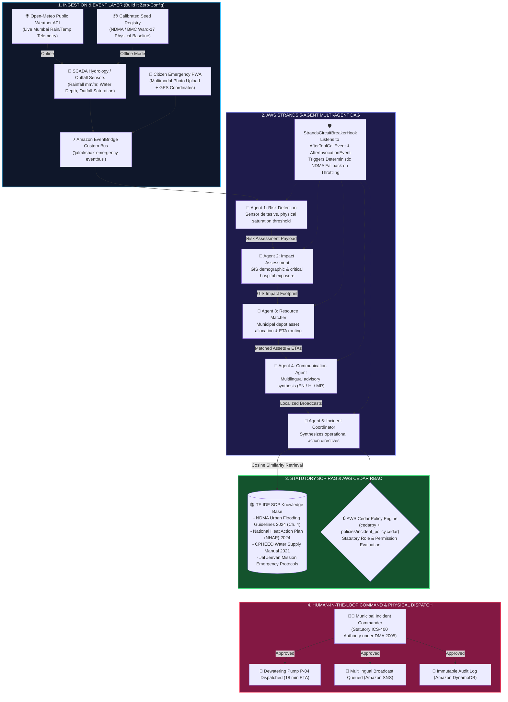

# JalRakshak AI — System Architecture & Data Flow

This document details the complete end-to-end architecture of **JalRakshak AI**, an autonomous climate and water emergency decision command platform built using the **AWS Strands Agents SDK**, **AWS Cedar**, and **AWS Serverless Application Model (SAM)**.

---

## 1. High-Level Architecture Diagram

---

## 2. Component Specifications

### 2.1 Multi-Agent DAG (`AWS Strands Agents SDK`)
The pipeline runs as a directed sequence composed of 5 specialized agents subclassing `strands.Agent`:
1. **`risk_detection_agent`**: Evaluates rainfall rate ($\text{mm/hr}$), flood depth ($\text{cm}$), and drainage saturation against physical discharge ceilings. In offline mode, uses `LocalDeterministicModel`. In live cloud mode, connects to `BedrockModel` (Claude 3.5 Sonnet).
2. **`impact_assessment_agent`**: Maps hazard perimeters onto Ward GIS demographic registries, computing vulnerable populations and critical facility proximity.
3. **`resource_matching_agent`**: Computes nearest available emergency assets (1000 GPM dewatering pumps, medical vans, drinking water bowsers) and generates transit ETAs.
4. **`communication_agent_instance`**: Generates localized public alerts in English, Hindi, and Marathi formatted for SMS and WhatsApp distribution.
5. **`coordinator_agent_instance`**: Queries the statutory SOP RAG database and formulates prioritized action directives.

### 2.2 Statutory Policy Engine (`AWS Cedar`)
Statutory authorization is defined declaratively in `policies/incident_policy.cedar` and evaluated via `cedarpy`:
- **`incident_commander`**: Permitted `read_incidents`, `approve_action`, `dispatch_resource`, `broadcast_sns`, `simulate_scenario`.
- **`scada_analyst`**: Permitted `read_incidents`, `read_telemetry`, `inspect_sensors`.
- **`field_responder`**: Permitted `read_incidents`, `update_status`.
- **`citizen`**: Permitted `submit_report`, `read_advisories`; explicitly forbidden from `approve_action`, `dispatch_resource`, `broadcast_sns`.

### 2.3 Serverless Infrastructure as Code (`AWS SAM CLI`)
Defined in `aws_infra/template.yaml`:
- **`StrandsAgentOrchestratorLambda`**: Bound to `StrandsExecutionRole` with least-privilege policies for DynamoDB, EventBridge, Bedrock, and SNS.
- **`CitizenReportIngestLambda`**: Bound to `CitizenIngestExecutionRole` with access to S3, Rekognition, and DynamoDB.
- **`EmergencyEventBus`**: Amazon EventBridge custom event bus for sensor threshold triggers.
- **`EmergencyAlertsTopic`**: Amazon SNS topic for multilingual emergency broadcasting.
- **`EvidenceBucket`**: Amazon S3 bucket for field telemetry photos.
- **State Tables**: DynamoDB tables for incidents, municipal resources, citizen reports, and audit logs.
